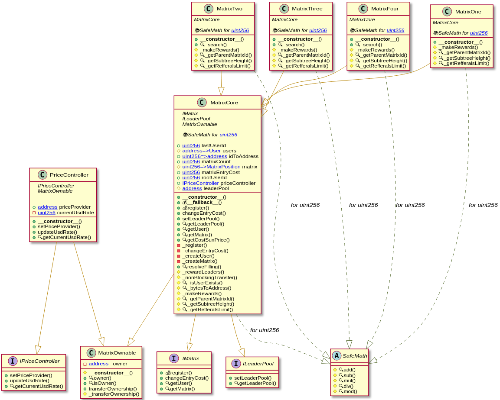

# Matrix contracts

Implementation of the mlm-system "Matrix"

- Lang: Solidity v0.5.12

- Project framework: truffle ^5.1.44

## Project structure:
```
contracts/
├── core
│   ├── ILeaderPool.sol
│   ├── IMatrix.sol
│   ├── MatrixCore.sol
│   └── MatrixOwnable.sol
├── IPriceController.sol
├── MatrixFour.sol
├── MatrixOne.sol
├── MatrixThree.sol
├── MatrixTwo.sol
└── PriceController.sol
```

- __/core__ - Core of mlm system

- __Matrix\<Number\>.sol__ - Instance of a specific matrix

- __PriceController.sol__ - Registration cost controller contract

## Interfaces

```
interface IMatrix {

    struct MatrixPosition {
        uint256 parentMatrixId;
        address payable userAddress;
        bool closed;
        uint256 subtreeMatrixCount;
        uint256[] childMatrixIds;
    }

    struct User {
        uint256 id;
        address referrerAddress;
        uint256 referralsCount;
        uint256[] matrixIds;
    }

    function register(address _referrerAddress) external payable returns(uint256);

    function changeEntryCost(uint256 _newCost) external returns(uint256);

    function getUser(address _userAddress) external view returns(uint256, address, uint256, uint256[] memory);

    function getMatrix(uint256 _matrixId) external view returns(
        uint256,
        address payable,
        bool,
        uint256,
        uint256[] memory
    );

}

interface ILeaderPool {

    function setLeaderPool(address payable[10] calldata) external returns(bool);

    function getLeaderPool() external view returns(address payable[10] memory);

}

interface IPriceController {

    function getCurrentUsdRate() external view returns(uint256);

}

```

## Events

```
event RegisterSuccessful(
    address indexed newUserAddress,
    uint256 indexed newUserId,
    address indexed referrerAddress,
    uint256 referrerId,
    uint256 newMatrixId,
    uint256 sendingValue,
    uint256 timestamp
);
event UserCreated(
    address indexed newUserAddress,
    address indexed referrerAddress,
    uint256 indexed newUserId,
    uint256 timestamp
);
event MatrixCreated(
    uint256 indexed matrixId,
    uint256 indexed parentMatrixId,
    address indexed userAddress,
    uint256 timestamp
);
event Reinvest(
    uint256 indexed matrixId,
    address indexed userAddress,
    uint256 timestamp
);

event MakedRewards(address payable indexed _contextUpline, uint256 timestamp);

event TransferSuccess(address payable indexed recipient, uint256 indexed value, uint256 timestamp);

event TransferError(address payable indexed recipient, uint256 indexed value, uint256 timestamp);

event MatrixEntryCostChanged(uint256 indexed newCost, uint256 indexed oldCost, uint256 timestamp);
```


## Inheritance:



## Installation & Usage

Install packages
```
npm i --save-dev
```

### Build project:
```
npm run build
```

### Testing
```
npm test
```

### Test coverage
```
npm run coverage
```

### Run linters
```
npm run lint
```

For external networks use ENV "`PRIVATE_KEY`".